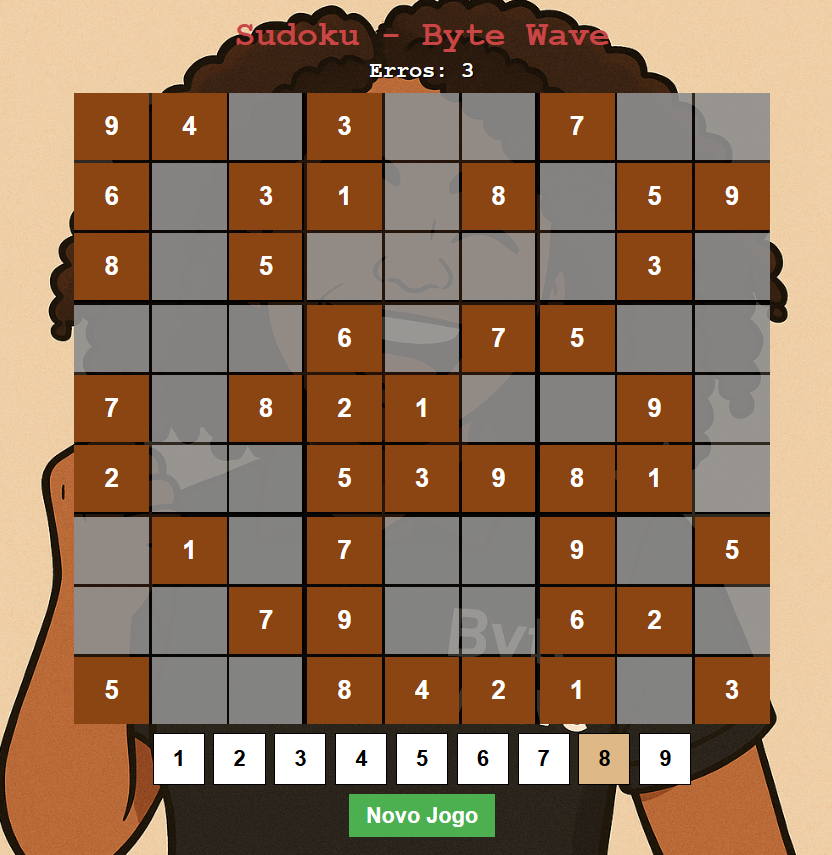

<h1 align="center">🧠 Sudoku - Byte Wave</h1>

  
  

  Jogo de Sudoku desenvolvido em Java com interface gráfica personalizada (Swing).  
  Um projeto que estimula a lógica e o raciocínio em uma experiência visual envolvente.

---

##  Preview do Design

  

---

##  Funcionalidades

-  Interface gráfica com fundo customizado
-  Sistema de validação de jogadas
-  Contador de erros
-  Mensagens motivacionais e de vitória
-  Números fixos (pré-preenchidos) e editáveis
-  Sistema de seleção de número (1 a 9)
-  Estrutura pronta para implementação de Sudoku dinâmico

---

## 🛠️ Tecnologias Usadas

-  Java 17+
-  Imagem de fundo com `BufferedImage` + transparência

---

##  Melhorias Futuras

O projeto ainda está em desenvolvimento e novas funcionalidades estão planejadas:

- **Gerar tabuleiros aleatórios válidos**  
  Gerador automático de puzzles que seguem as regras do Sudoku.

- **Adicionar níveis de dificuldade**  
  Modos fácil, médio e difícil, com base na quantidade de células preenchidas.

- **Timer (cronômetro)**  
  Medir o tempo da partida, permitindo desafios e melhorias pessoais.

- **Suporte a teclado**  
  Permitir o controle total do jogo por teclado, melhorando a acessibilidade.

